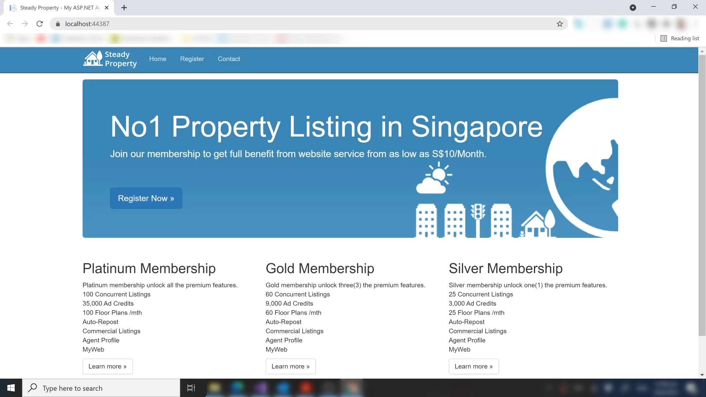
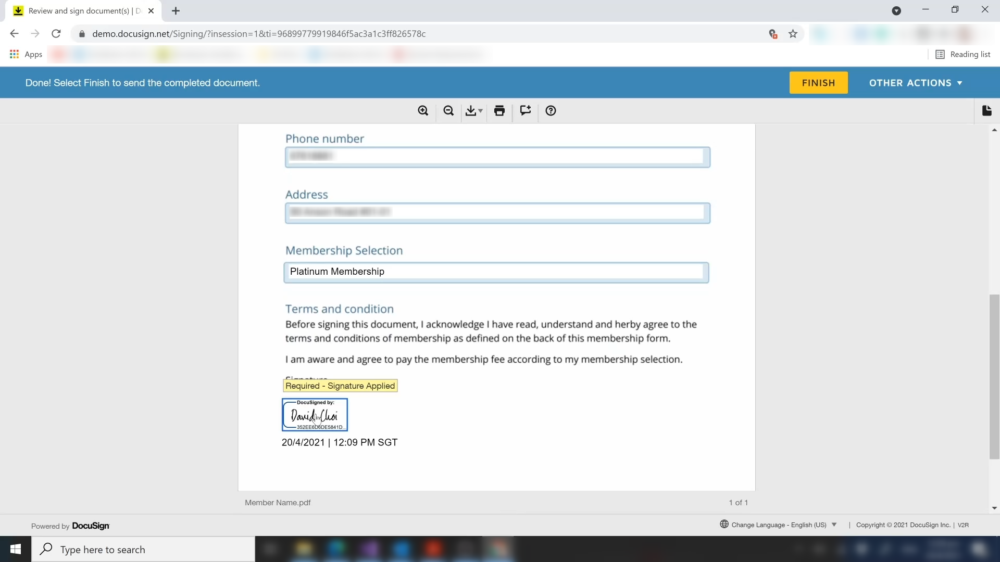
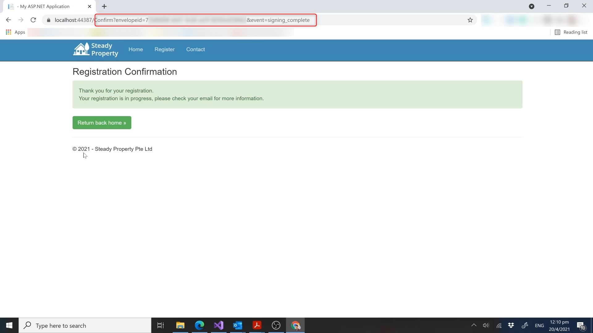

## Docusign API Embedded Application

This is sample web application to show Docusign API Embedded signing, more information please go to this link [Docusign Embedded Signing Information](https://developers.docusign.com/docs/esign-soap-api/esign101/embedding/)

#### Docusign header
```csharp
private string AccessToken = "";
private string DS_CLIENT_ID = "COPY YOUR INTEGRATION KEY LOCATED ON YOUR APPLICATION";
private string DS_IMPERSONATED_USER_GUID = "ENTER YOUR IMPERSONATE USER ID";
private string DS_AUTH_SERVER = "account-d.docusign.com";
private string DS_PRIVATE_KEY = "COPY YOUR PRIVATE KEY AT privatekey2.txt";
private string AccountIDVar = "";
```

#### Mockup image
<table>
<tr>
<td>
Mockup page<br>

</td>
<td>
Member registration page<br>

</td>
</tr>
<td>
Signing (Docusign)<br>

</td>
<td>
Completion callback<br>

</td>
</tr>
<td>
Email confirmation<br>

</td>
<td>
Signed PDF file<br>

</td>
</tr>
</table>
